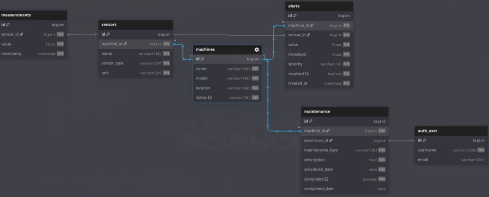

# Industrial Monitoring API

Backend API for monitoring industrial machines, sensors,
measurements, alerts and maintenance.

## Technologies

- Python
- Django
- PostgreSQL
- Django REST Framework
- Pytest
- Docker
- GitHub Actions

## DB Schema

